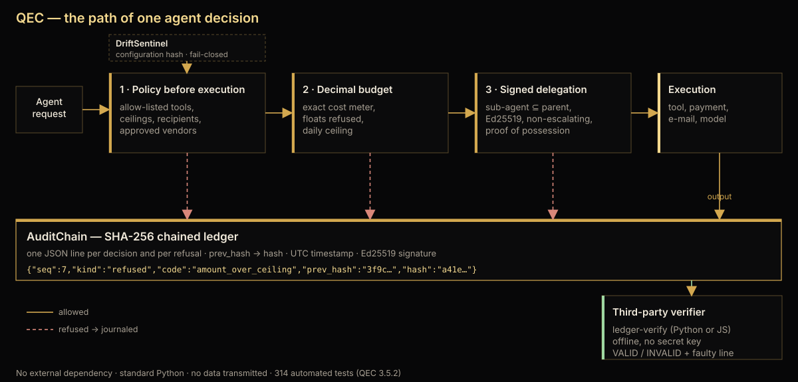

# QEC — architecture of one decision

Reading the figure left to right: an agent request enters the **policy** stage (allow-listed tools, ceilings,
recipients, approved vendors), then the **Decimal budget** (exact cost meter, floats refused, cumulative ceiling), then
**signed delegation** (a sub-agent holds a subset of its parent's authority, never more). Only then does **execution**
happen. Every refusal and every allowed outcome is appended to **AuditChain**, a SHA-256 chained JSONL ledger, which a
**third-party verifier** checks offline without any secret. **DriftSentinel** hashes the configuration and refuses,
fail-closed, a policy that changed without an approval.

Public reproduction of each box: `qec-governed-agent-demo` (semantics), `ledger-verify` (verifier and format),
`qec-demo-agents` (seven platform scenarios). Threats and residual risks: `THREAT_MODEL.md`. Framework relevance:
`CONTROL_MAPPING.md`. Cost: `BENCHMARK.md`. Thirty-minute check: `EVALUATION_GUIDE.md`.

The figure describes the public control path. Internal thresholds, signature formats, key custody and any
patent-enabling detail stay outside this repository.
